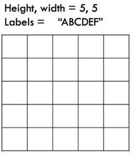
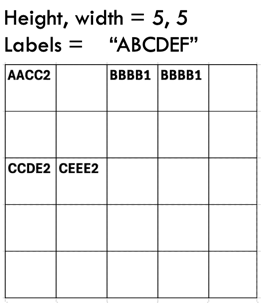
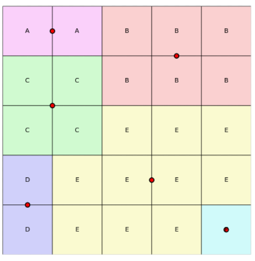

# Galaxy LAP Puzzle
Group Members: Meiqi Wen

## Introduction
### Original Puzzle:

(1) LAP: Week 5 Puzzle

(2) Galaxy Puzzle

The original Galaxy puzzle asks players to divide the grid into regions centered on dots, where each region has 180-degree rotational symmetry. 

The goal is to figure out the correct shape of each region using spatial logic, making sure all regions are symmetric and non-overlapping.

### My variant Puzzle: Galaxy LAP Puzzle
#### Initial Setup

At the start of the game, players are given:
- The **height and width** of the grid
- The set of **galaxy labels** (e.g., A, B, C, ...) used in the solution

Each **region**:
- Is **connected** (cells must be adjacent via up/down/left/right)
- Has a **unique letter label**
- Must be **180° rotationally symmetric** around a center point within the region

**Example: Initial Grid Setup (5×5, Labels = "ABCDEF")**

---

#### Query Mechanism

Players can query any **2×2 square** on the grid.  
Each query returns:
- The **four letters** within that 2×2 square (e.g., `"AACC"`)
- The **number of galaxy centers** located *in or touching* that square

**Example**:  
Querying the square at `(0, 0)` might return: `"AACC2"`

This means:
- The square contains letters **A, A, C, C**
- There are **2 centers** located in or touching this square

**Example: Clue Query Result for a 2×2 Square**

---

#### Objective

Using as **few queries (clues)** as possible,  
players must determine the **entire grid**,  
by assigning a correct label to **every cell**,  
ensuring all regions follow the rules of **uniqueness, connectivity, and symmetry**.

**Example: Final Puzzle Solution with Labeled Regions and Centers**

## Algorithm and Time Complexity for Solver

### Overview

The solver follows a **clue-driven search** strategy that iteratively narrows down the search space by querying 2×2 square regions and checking for solution consistency using DFS and symmetry validation.

---

### Algorithm Steps

1. **Initial Setup**  
  Start by querying an appropriate number of initial clues based on the grid size.

2. **DFS Search (`dfs`)**  
   A depth-first backtracking search attempts to fill the grid cell by cell. At each step:
   - **Allowed labels** are filtered using existing clue constraints (`get_possible_labels`)
   - A label is temporarily assigned and the grid is updated
   - **Early pruning** is applied using `is_valid_so_far()`, which checks:
     - Whether completed regions are **connected**
     - Whether they satisfy **180° rotational symmetry**
     - Whether center placement is consistent with known **clue counts**

3. **Clue Evaluation (`find_next_clue`)**  
   If multiple valid solutions remain, the solver selects the next 2×2 clue square  
   that shows the most **divergence** among current solutions, to maximize information gain.

4. **Termination**  
   The process repeats—querying, solving, validating—until exactly **one unique solution** is found.

---

### Time Complexity Analysis

| Component             | Big-O (Worst)              | Big-Ω (Best)  | Big-Θ (Average)              | Notes                                                   |
|-----------------------|-----------------------------|---------------|-------------------------------|---------------------------------------------------------|
| `solve()`             | O(q × kⁿᵐ × n × m)         | Ω(n × m)      | Θ(q × pⁿᵐ × n × m)          | q = clue rounds; p ≪ k after pruning                    |
| `dfs()`               | O(kⁿᵐ × n × m)             | Ω(n × m)      | Θ(pⁿᵐ × n × m)              | Backtracking; validates at every step                  |
| `find_next_clue()`    | O(S × n × m)               | Ω(S × n × m)  | Θ(S × n × m)                | S = current candidate solutions (≤ 5)                  |
| `is_valid_so_far()`   | O(n × m)                   | Ω(n)          | Θ(n × m)                    | Includes region connectivity and center validation     |

- `n × m`: Grid size  
- `k`: Number of unique labels
- `p`: Effective branching factor after pruning (p ≪ k)  
- `S`: Number of current solution candidates (capped at 5 in our implementation)

---
